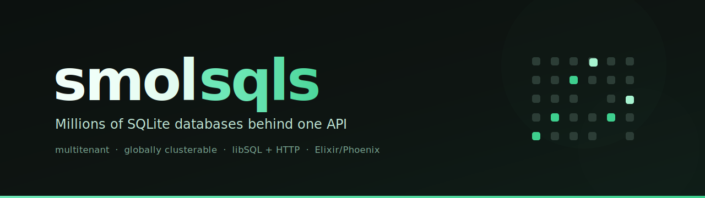

# smolsqls

<p align="center">
  
</p>

> Millions of SQLite databases behind one API — multitenant, globally
> clusterable, and drivable entirely over HTTP.

[](https://github.com/chasers/smolsqls/actions/workflows/ci.yml)
[](https://elixir-lang.org)
[](LICENSE)


Sign up for a tenant, create SQLite databases over a REST API (or a small
LiveView UI), get a connection string back, and connect with any stock libSQL
client or plain HTTP. No custom driver, no human steps in the loop — the whole
lifecycle is a handful of `curl`s. Written in Elixir/Phoenix and built for ~1M
databases per cluster across ~10 data-plane nodes.

## Quick start

```sh
# discover the API
curl http://localhost:4000/v1

# sign up (api_key returned once)
curl -X POST http://localhost:4000/v1/tenants \
  -H 'content-type: application/json' \
  -d '{"name": "My Org", "slug": "my-org"}'

# create a database (returns auth_token + connection strings)
curl -X POST http://localhost:4000/v1/databases \
  -H "authorization: Bearer $API_KEY" \
  -H 'content-type: application/json' \
  -d '{"name": "task-db"}'

# query it
curl -X POST http://localhost:4000/v1/databases/$DB_ID/query \
  -H "authorization: Bearer $DB_TOKEN" \
  -H 'content-type: application/json' \
  -d '{"sql": "SELECT 1"}'
```

Or connect with a stock libSQL client — nothing custom to install:

```js
import { createClient } from "@libsql/client";

const client = createClient({
  url: "ws://localhost:4000",
  authToken: process.env.DB_TOKEN,
});
await client.execute("SELECT 1");
```

## Features

- **Multitenant at scale** — millions of independent SQLite databases per
  cluster; each is its own file with a single serialized writer.
- **Connect with anything** — any stock libSQL client over WebSocket or HTTP
  (Hrana v1/v2/v3), or plain `POST .../query` with a bearer token. Interactive
  transactions, browser clients (CORS open), edge runtimes.
- **Branching** — fork any database into a new, independent one from a snapshot
  or an exact point in time (litestream-backed), without touching the parent's
  writer. Branches can be ephemeral.
- **Backups & restore** — a guaranteed daily backup floor plus on-demand
  backups; download any backup as a plain `.db` file, restore in place.
- **Regions** — each database has a primary region; a global host geo-routes to
  the nearest one, and you can move a database between regions online.
- **Sandboxed tenant SQL** — a SQLite authorizer denies `ATTACH`/`DETACH`/
  `VACUUM` and extension loading, isolating tenants on the shared connection.
- **Agent-friendly by design** — every response is `{"data": ...}`, every error
  a stable `{"error": {"code", "message"}}`; `GET /v1` documents the full
  contract. No dashboard step is ever required.

## How it works

The short version — see [`docs/architecture.md`](docs/architecture.md) for the
full walk-through.

- **Postgres is the source of truth, never on the query path.** Every node keeps
  a full ETS replica of the request-path tables, kept live over a logical
  replication slot. Postgres downtime pauses create/delete; queries keep working.
- **One GenServer per database** owns the single `exqlite` connection, activates
  lazily on first query, and stays hot for an idle TTL. `syn` guarantees a single
  writer cluster-wide; cross-node queries travel over `gen_rpc`.
- **The object store is the source of truth for cold databases**; node volumes
  are just caches. Idle databases ship a compressed `VACUUM INTO` snapshot, so
  draining or moving a node is mostly metadata.
- **Placement is per-database and region-aware** — a global host geo-routes to
  the owning region, and any node transparently proxies to the owner.
- **Durability is owned by the Kubernetes operator** ([`operator/`](operator/)):
  PVC-backed volumes, Litestream replication, CRD-driven backup/restore.
- **Credentials, quotas, and limits are rows, not config** — managed token
  lifecycle (hashed + encrypted at rest), row-based per-tenant/per-database
  limits resolved from the read model.

## Running locally

Requires Erlang/OTP 27+, Elixir 1.20+, and Postgres on `localhost:5432`
(`postgres`/`postgres`).

```sh
mix setup
iex --sname smolsqls -S mix phx.server
```

The LiveView UI is at [`localhost:4000`](http://localhost:4000) — sign up or
paste a tenant API key, then create/delete databases, reveal connection strings
alongside ready-to-run curl and `@libsql/client` quickstart snippets, and trigger
backups from the dashboard. The **API keys** page (`/account`) manages
account-level tenant keys: create any number (optionally named), reveal, copy,
enable/disable, and delete — new signups land here to copy their first key.

### More lifecycle examples

```sh
# trigger / list backups, download one as a .db file, restore
curl -X POST http://localhost:4000/v1/databases/$DB_ID/backups \
  -H "authorization: Bearer $API_KEY"
curl -X GET http://localhost:4000/v1/databases/$DB_ID/backups/$BACKUP_ID/download \
  -H "authorization: Bearer $API_KEY" -o backup.db
curl -X POST http://localhost:4000/v1/databases/$DB_ID/restore \
  -H "authorization: Bearer $API_KEY" \
  -H 'content-type: application/json' \
  -d "{\"backup_id\": \"$BACKUP_ID\"}"

# branch it into a new, independent database seeded from its latest snapshot
# (returns the new database + its auth_token, like create)
curl -X POST http://localhost:4000/v1/databases/$DB_ID/branch \
  -H "authorization: Bearer $API_KEY" \
  -H 'content-type: application/json' \
  -d '{"name": "task-db-branch"}'

# branch to an exact point in time (litestream-enabled sources only; within the
# last 30 days) by adding a "timestamp" (RFC3339)
curl -X POST http://localhost:4000/v1/databases/$DB_ID/branch \
  -H "authorization: Bearer $API_KEY" \
  -H 'content-type: application/json' \
  -d '{"name": "task-db-pit", "timestamp": "2026-07-07T12:00:00Z"}'
```

## Deploying (Kubernetes)

`deploy/` holds kustomize manifests: a 3-replica StatefulSet where pod
`smolsqls-N` ↔ PVC `data-smolsqls-N` ↔ Erlang node name (the volume-claim
identity model), each pod running a Litestream sidecar that databases are
registered with dynamically over a control socket. A PodDisruptionBudget
(`maxUnavailable: 1`) keeps voluntary disruptions (node drains/upgrades) from
taking down more than one pod at a time, preserving quorum. The
[operator](operator/) tracks one `SqliteNode` CR per data-plane node — never per
database — reporting replication-slot health and database counts onto
`kubectl get sqlitenodes`. Setting `spec.drain: true` inserts a request into the
metadb's `node_drains` table; the data plane's drain worker claims it, idle-stops
hot databases (shipping their snapshots), reassigns placement rows to the
survivors, and the operator reports progress on `status.drain`. Re-draining a
node requires deleting its `node_drains` row.

**Multi-region** (in progress): nodes advertise their name over the shared metadb
and connect by it, so cross-region clustering needs names that resolve and route
from every region. A node defaults to its single-cluster headless DNS name; set
`RELEASE_NODE_HOST` to a cross-cluster-routable host (e.g. a GKE
Multi-Cluster-Services clusterset FQDN over a shared VPC) for a multi-region
cluster. The application already proxies queries to a database's owning region
over `gen_rpc`; the remaining work is the deploy topology (per-region clusters, a
global load balancer) and hardening the single-writer guarantee against WAN
partitions — tracked in the `regional-placement` plan.

Local end-to-end cluster (kind + in-cluster Postgres with `wal_level=logical` +
MinIO):

```sh
./scripts/kind-up.sh
curl http://localhost:8080/v1
```

`kubectl` here is scoped to the local `kind-smolsqls` cluster via
[direnv](https://direnv.net): `.envrc` exports `KUBECONFIG=$PWD/.kube/config`, a
gitignored single-context kubeconfig (run `direnv allow` once). Regenerate it with
`mkdir -p .kube && kubectl config view --minify --flatten --context kind-smolsqls
> .kube/config`.

The `FORCE_SSL` Docker build arg (default `true`) gates the compile-time
`force_ssl` redirect; build with `--build-arg FORCE_SSL=false` when the endpoint
sits behind a plain-HTTP load balancer. A full GCP/GKE deployment (Terraform +
kustomize overlay for Cloud SQL, GCS, and Artifact Registry) lives in the sibling
`smolsqls-deploy` repo.

## Tests

```sh
mix test                        # unit + integration (needs Postgres)
mix test --include distributed  # + multi-node syn/gen_rpc tests (needs epmd)
```

The distributed tests boot a real peer BEAM node with `:peer`, place a database
server on it, and assert that syn resolves it from the primary node and that
queries round-trip over gen_rpc (on a distinct TCP port), including deregistration
when the peer dies.

`netsplit_test.exs` goes further: it boots the peer with its control channel on
`:standard_io` (independent of Erlang distribution), so it can sever distribution
between the nodes — a cookie mismatch plus `disconnect_node`, which also blocks
reconnection — while still driving both sides with `:peer.call`. It uses that to
drive `:syn` into a real registry conflict across a healed partition and assert
the `SynHandler` resolves it to one deterministic surviving writer.

## Quality gate

```sh
mix precommit  # mutating: compile -Werror, format, credo --strict, test
mix ci         # non-mutating superset CI runs (no DB needed)
```

`mix ci` is the merge gate: `hex.audit` (dependency CVEs) → compile
(warnings-as-errors) → `deps.unlock --check-unused` → `format --check-formatted` →
`credo --strict` (with the [ExSlop](https://github.com/elixir-vibe/ex_slop)
plugin's AI-slop checks) → `deps.audit` → `sobelow` (security scan, `.sobelow-conf`
holds accepted skips) → `reach.check --arch`
([Reach](https://github.com/elixir-vibe/reach) layer policy in `.reach.exs`: the
data/control/read planes must not depend on the web layer). CI runs it as a fast,
Postgres-free `checks` job in parallel with the test jobs; the `operator/`
subproject has its own `mix ci` and test job.

Two more checks run in their own CI jobs (not in `mix ci`, so the fast gate stays
fast):

```sh
mix dialyzer   # type analysis; PLT cached in CI on {OTP, Elixir, mix.lock}
mix ex_dna     # duplication report ([ExDNA](https://github.com/elixir-vibe/ex_dna), advisory)
```

Dialyzer gates (ignore file: `.dialyzer_ignore.exs`); ExDNA is advisory for now
(`.ex_dna.exs`), to be ratcheted to a `--max-clones` budget once its count is
stable. See `.github/workflows/ci.yml`.

## Repo layout

```
lib/smolsqls/control_plane*    # tenants, databases, placement metadata (Ecto/Postgres)
lib/smolsqls/data_plane*       # per-database servers, syn registry, gen_rpc router
lib/smolsqls/infra*            # port to the durability layer (Local / Kubernetes adapters)
lib/smolsqls_web/controllers/  # REST API (see GET /v1 for the index)
lib/smolsqls_web/hrana/        # Hrana (libSQL) WebSocket endpoint
lib/smolsqls_web/live/         # LiveView dashboard
operator/                     # Bonny-based Kubernetes operator (SqliteDatabase CRD)
bench/                        # performance harnesses + RESULTS.md (qps, cold_start, litestream_density, schedulers)
skills/                       # Claude Code skills (run skills/install.sh to link them in; see skills/README.md)
```

Benchmarks live under `bench/<area>/` with a `RESULTS.md` per area. The query-path
ones run locally via `mix run bench/<area>/*.exs`; the cluster ones
(`bench/qps/kind_latency.sh`, `bench/cold_start/run.sh`) `kubectl exec` into a pod
to measure against the real MinIO/S3 store and cross-pod topology.

## Architecture

The one-screen version is [above](#how-it-works); the full walk-through — control
plane, data plane, storage portability, backups, branching, regions, client
transports, the tenant SQL sandbox, quotas, tokens, failover, and durability —
lives in [`docs/architecture.md`](docs/architecture.md).

## License

[Apache License 2.0](LICENSE).
